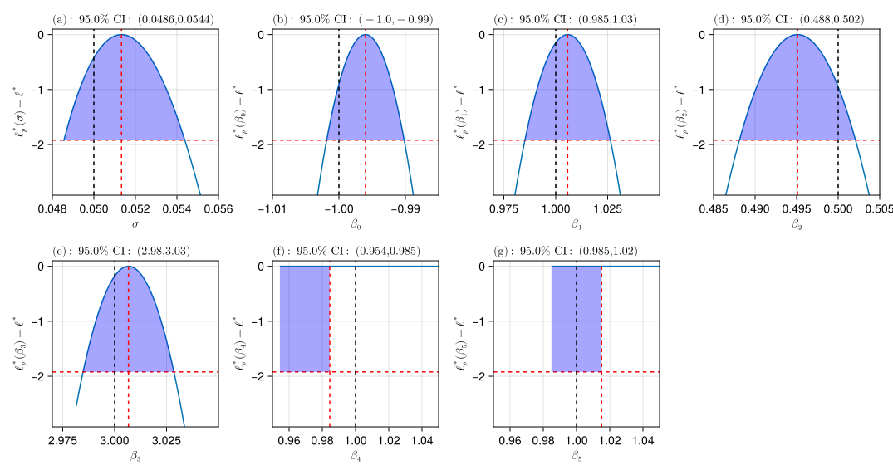
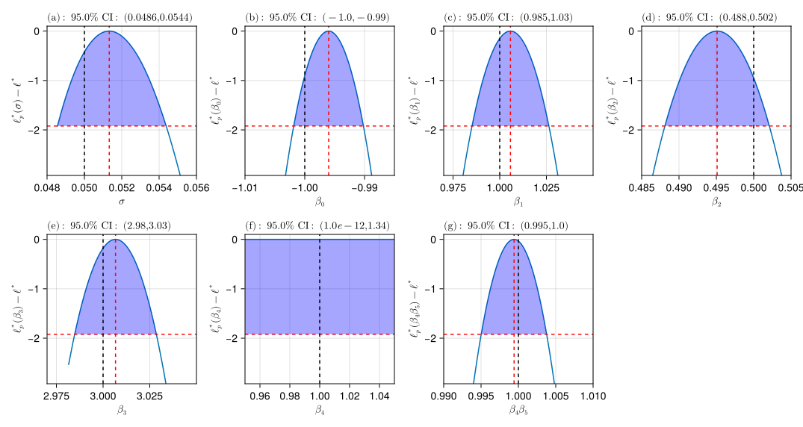

# ProfileLikelihood 

[](https://zenodo.org/badge/latestdoi/508701126)
[](https://DanielVandH.github.io/ProfileLikelihood.jl/dev)
[](https://DanielVandH.github.io/ProfileLikelihood.jl/stable)
[](https://github.com/DanielVandH/ProfileLikelihood.jl/actions/workflows/CI.yml?query=branch%3Amain)
[](https://codecov.io/gh/DanielVandH/ProfileLikelihood.jl)

This package defines the routines required for computing maximum likelihood estimates and profile likelihoods. The optimisation routines are built around the [Optimization.jl](https://github.com/SciML/Optimization.jl) interface, allowing us to e.g. easily switch between algorithms, between finite differences and automatic differentiation, and it allows for constraints to be defined with ease. We allow for univariate or bivariate profiles.

# Example Usage

Here is an example of how the package can be used. See the documentation for more examples, where we also show how to compute prediction intervals and bivariate profiles and how to apply these methods to differential equations.

We consider the problem
```math 
y_i = \beta_0 + \beta_1 x_{1i} + \beta_2 x_{2i} + \beta_3 x_{1i}x_{3i} + \beta_4\beta_5 x_{4i} + \varepsilon_i, \quad \varepsilon_i \sim \mathcal N(0, \sigma^2), \quad i=1,2,\ldots,n,
```
and our aim is to estimate $\boldsymbol\theta = (\beta_0, \beta_1, \beta_2, \beta_3, \beta_4, \beta_5 \sigma^2)$. Notice that the parameters $\beta_4$ and $\beta_5$ appear only as a product, so there may be identifiability issues with $\beta_4\beta_5$. To start, we generate some data.
```julia 
using Random, Distributions, StableRNGs
rng = StableRNG(98871)
n = 600
β = [-1.0, 1.0, 0.5, 3.0, 1.0, 1.0]
σ = 0.05
x₁ = rand(rng, Normal(0, 0.2), n)
x₂ = rand(rng, Uniform(-1, 1), n)
x₃ = rand(rng, Normal(0, 1), n)
x₄ = rand(rng, Exponential(1), n)
ε = rand(rng, Normal(0, σ), n)
X = hcat(ones(n), x₁, x₂, x₁ .* x₃, x₄)
βcombined = [β[1], β[2], β[3], β[4], β[5] * β[6]] # so it's a regression problem
y = X * βcombined + ε
```
The data `y` is now our noisy data. Since the residuals are normally distributed, our log-likelihood function is 
```math 
\ell(\boldsymbol\theta \mid \boldsymbol y) = -\frac{n}{2}\log(2\pi\sigma^2) - \frac{1}{2\sigma^2}\sum_{i=1}^n \left(y_i - \beta_0 - \beta_1 x_{1i} - \beta_2 x_{2i} - \beta_3 x_{1i}x_{3i} - \beta_4\beta_5 x_{4i}\right)^2.
```
We can now define the log-likelihood function. To allow for automatic differentiation, we use `PreallocationTools.DiffCache` from [PreallocationTools.jl](https://github.com/SciML/PreallocationTools.jl).
```julia
using PreallocationTools, LinearAlgebra
sse = DiffCache(zeros(n))
βcache = DiffCache(similar(β, length(β) - 1), 10) # -1 because we combine β[5] and β[6]
data = (y, X, sse, n, βcache)
function loglik(θ, data)
    σ, β₀, β₁, β₂, β₃, β₄, β₅ = θ
    β₄β₅ = β₄ * β₅
    y, X, sse, n, β = data
    _sse = get_tmp(sse, θ)
    _β = get_tmp(β, θ)
    _β .= (β₀, β₁, β₂, β₃, β₄β₅)
    ℓℓ = -0.5n * log(2π * σ^2)
    mul!(_sse, X, _β)
    for (yᵢ, sseᵢ) in zip(y, _sse)
        ℓℓ -= 0.5 * (yᵢ - sseᵢ)^2 / σ^2
    end
    return ℓℓ
end
```
We can now define the likelihood problem. We constrain $\sigma$ to be positive and leave $\boldsymbol\beta$ unconstrained.
```julia
using ProfileLikelihood, Optimization
θ₀ = ones(7) # initial guess 
prob = LikelihoodProblem(loglik, θ₀; data,
    f_kwargs=(adtype=Optimization.AutoForwardDiff(),),
    prob_kwargs=(
        lb=[0.0, -Inf, -Inf, -Inf, -Inf, -Inf, -Inf],
        ub=fill(Inf, 7),
    ),
    syms=[:σ, :β₀, :β₁, :β₂, :β₃, :β₄, :β₅])
```
Now we can finally compute the maximum likelihood estimates and thus the profile likelihoods. Since we have do not have bounds on all the parameters, we need to provide the parameter bounds for profiling ourselves.
```julia 
using OptimizationNLopt
sol = mle(prob, (NLopt.LN_NELDERMEAD(), NLopt.LD_LBFGS())) # can provide multiple algorithms to run one after the other
prof_lb = [1e-12, -5.0, -5.0, -5.0, -2.0, -5.0, -5.0]
prof_ub = [15.0, 15.0, 15.0, 15.0, 15.0, 15.0, 15.0]
resolutions = [1200, 200, 200, 200, 200, 200, 200] # use many points for σ
param_ranges = construct_profile_ranges(sol, prof_lb, prof_ub, resolutions)
prof = profile(prob, sol; param_ranges, parallel=true)
```
```
ProfileLikelihoodSolution. MLE retcode: Success
Confidence intervals:
     95.0% CI for σ: (0.04855786315837859, 0.05437892987325201)
     95.0% CI for β₀: (-1.0018489708905645, -0.9901815711646778)
     95.0% CI for β₁: (0.9851645388761775, 1.0263131430542836)
     95.0% CI for β₂: (0.4881124597719428, 0.5020910392590251)
     95.0% CI for β₃: (2.984798581472374, 3.0285274452115227)
     95.0% CI for β₄: (0.9544410678614798, 0.9845140025474981)
     95.0% CI for β₅: (0.9849142023375428, 1.015141041743288)
```

```julia
using CairoMakie
fig = plot_profiles(prof,
    true_vals=[σ, β...],
    axis_kwargs=(width=200, height=200),
    xlim_tuples=[(0.048, 0.056), (-1.01, -0.985), (0.97, 1.050),
        (0.485, 0.505), (2.97, 3.050), (0.95, 1.05),
        (0.95, 1.05)],
    ncol=4, nrow=2
) # see the ?plot_profiles docstring for more options
resize_to_layout!(fig)
fig
```


See that, as expected, the profiles for $\beta_4$ and $\beta_5$ are flat as only the product $\beta_4\beta_5$ is identifiable. We can reparametrise the model in terms of $\beta_4\beta_5$ to see the difference. In particular, we now have $\boldsymbol\theta = (\sigma, \beta_0, \beta_1, \beta_2, \beta_3, \beta_4, \beta_4\beta_5)$.

```julia
using StaticArrays 
function repar_loglik(θ, data)
    σ, β₀, β₁, β₂, β₃, β₄, β₄β₅ = θ
    θ′ = @SVector[σ, β₀, β₁, β₂, β₃, β₄, β₄β₅/β₄]
    return loglik(θ′, data)
end
prob = LikelihoodProblem(repar_loglik, θ₀; data,
    f_kwargs=(adtype=Optimization.AutoForwardDiff(),),
    prob_kwargs=(
        lb=[0.0, -Inf, -Inf, -Inf, -Inf, 1e-12, -Inf], # 1e-12 to avoid division by zero
        ub=fill(Inf, 7),
    ),
    syms=[:σ, :β₀, :β₁, :β₂, :β₃, :β₄, :β₄β₅])
sol = mle(prob, (NLopt.LN_NELDERMEAD(), NLopt.LD_LBFGS())) 
prof_lb[6] = 1e-12
param_ranges = construct_profile_ranges(sol, prof_lb, prof_ub, resolutions)
prof = profile(prob, sol; param_ranges, parallel=true)
fig = plot_profiles(prof,
    true_vals=[σ, β...],
    axis_kwargs=(width=200, height=200),
    xlim_tuples=[(0.048, 0.056), (-1.01, -0.985), (0.97, 1.050),
        (0.485, 0.505), (2.97, 3.050), (0.95, 1.05),
        (0.99, 1.01)],
    ncol=4, nrow=2
) 
resize_to_layout!(fig)
fig
```


We see that the product $\beta_4\beta_5$ is now identifiable (and $\beta_4$ is still not).